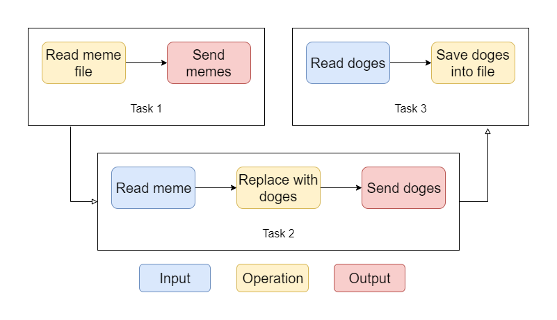

<!-- omit in toc -->
# Kirke

[](https://circleci.com/gh/aratare-tech/kirke/tree/develop)

> A great enchantress famous for Her knowledge of herbs, magical spells and dark enchantments. She is especially known for spells of transformation: She changed the beautiful nymph Skylla into a sea-monster because She was jealous of Her; Picus, who refused Her love, She turned into a woodpecker; and any mortal visitors to Her island were transformed into wild beasts.

Kirke is a neat tool that takes data from multiple sources, does things to it, then places it somewhere else.

<!-- omit in toc -->
## Table of Contents
- [Getting Started (TBC)](#getting-started-tbc)
- [Rationale](#rationale)
- [Goals](#goals)
- [Configuring Kirke](#configuring-kirke)
- [Graph](#graph)
- [Tasks](#tasks)
  - [Input](#input)
  - [Operation](#operation)
  - [Output](#output)
- [Trigger](#trigger)
- [Built-ins](#built-ins)
- [License](#license)

## Getting Started (TBC)
```clojure
[
    ;; Top level graph
    {
      ;; Unique ID across the graph.
      :id "e7179a98-d5b1-451f-86c0-883856832ee3"

      ;; Tasks within this graph.
      :tasks [
        ;; Here we read in a file, and select certain input from a database.
        {
          :id "8f661bde-40ae-4389-a9dc-6f3d590b79d"
          :type "reader"

          ;; Where to read the input
          :input [
            ;; File
            "file://meme.json"

            ;; Database
            {
              ;; `next.jdbc`-conformed credentials
              :db-creds 
              {
                :url "jdbc:mysql://localhost:3306/meme"
                :username "meme@meme.com"
                :password "defnotmeme"
              }
              ;; What to fetch out of the database with HoneySQL-conformed query map.
              :query
              {
                :select [:a :b :c]
                :from   [:foo]
                :where  [:= :f.a "baz"]
              }
            }
          ]

          ;; Where to output transformed data. In this case it's another task.
          :output [
            "aa9a96cf-ae73-4cbe-ad2a-1b6de890ea63"
          ]
        }

        ;; Some middle task to do some replacement
        {
          :id "aa9a96cf-ae73-4cbe-ad2a-1b6de890ea63"
          :type "converter"
          :params {
            :from "meme"
            :to "doge"
          }
          :output [
            "bd41f059-c450-46a5-91a6-c0923dcf01c8"
          ]
        }

        ;; Here we write into a file
        {
          :id "bd41f059-c450-46a5-91a6-c0923dcf01c8"
          :type "writer"
          :output [
            "file://doge.json"
          ]
        }
      ]
    }
]
```

## Rationale
Kirke is designed to do one thing, and one thing only: data.

As a developer, there are times when I want to move data from one place to another, or to morph data from one shape to another. Have a [quick search](https://www.softwaretestinghelp.com/best-etl-tools) and you can find tons of ETL tools out there.  Though these tools tend to be quite overwhelming for development purposes like, say, writing a small migration script to move data from the old to new database.

This is where libraries like [Apache Storm](https://storm.apache.org) comes in. Armed with tons of features, they are suitable for highly performant workload. If you are looking for some ETL libraries for production purposes, I highly recommend you use these libraries.

Awesome as they are, these libraries, again, are overkill for development purposes. This is where Kirke comes in. Kirke aims to provide life enhancement for developers who want to handle data during development process. Period. It is not designed for high-performant environments, nor features-packed. Instead I want a neat tool that can help me wrestle with data when I'm writing code so I don't have to write that bloody migration script in Python all the time.

## Goals
Kirke aims to achieve the following:
- **Simplistic but extensive:** Kirke is a life enhancement, as such it aims to minimise the hatred and disgust you may feel sometimes when using it. It also makes sure that when you do want to extend the functionality, you can.
- **Relatively fast:** Yes I did say Kirke is not designed to be performant, but surely you don't want to wait for 10 minutes each time you run it?

## Configuring Kirke
By default, Kirke reads an EDN file called `kirke.edn` upon start-up. The file contains various things such as:
- Graphs
- Tasks
- Triggers

`kirke.edn` consists of a list of graphs, each of which contains its own tasks and the dependencies between them.

At its simplest form, `kirke.edn` contains:
```clojure
[
  {
     ;; Graph 1
  }
  {
     ;; Graph 2
  }
  {
     ;; Graph 3
  }
  ;; ...
]
```

By itself `kirke.edn` does not contain any specific details. We first need to define graphs.

## Graph
A graph contains multiple tasks (nodes) and dependencies between them (edges). It represents the task topology as configured in `kirke.edn` for the specific pipeline.

To define a graph, all you need is an ID.

```clojure
{
  :id "88f28e83-5f4e-4fd3-979f-061898ebc6bc"
}
```

But a graph with no tasks is not really useful if you want to move data around. So you can start defining your own tasks
by adding a `:tasks` like this:

```clojure
{
  :id "88f28e83-5f4e-4fd3-979f-061898ebc6bc"
  :tasks [
    ;; Tasks here
  ]
}
```

Now let's see how we can define a task.

## Tasks
At the lowest level in Kirke are tasks. A task performs a single operation on an input, which produces an output.

```
Input --> Operation --> Output
```

A task can also have zero or _multiple_ inputs, each of which can come from different data sources, and zero or _multiple_ output, each can also be linked up to different places. 

A zero-input task is called a ***producer***, and an example of such task can be a data source that generates data on
the fly.

A zero-output task is called a ***consumer***, and is typically used for IO-related tasks such as file writer.

By itself a task is not as useful, if not sometimes unwieldy as it grows overtime and has to perform a lot of transformation steps. So instead, you can link up multiple tasks together to form a transformation graph that can move
data freely within the graph.

Here a visualisation of a transformation graph that has three tasks:



The flow starts when we read a file and ends when we write to a file. By having multiple tasks instead of one big task to handle everything, we can start modularise our data flow. For example, if we want to fetch data from an URL we only need to create a producer to do the fetching, and then link it up with our Task 2.

> You may wonder why `Read meme` and `Read meme file` are not the same (one is an operation the other one is an input). 
> You can check out further details in [Input](#input) and [Operation](#operation) sections. 
> 
> ***TL;DR***: Input treats everything that it receives as pure data whereas a file is only a data store (not the data 
> itself). Hence you need an operation to "unbox" the data store and retrieve the data within it.

There are multiple built-in tasks that provide most common functionality, however you can also create your own
task which can give you more freedom over how you want to process your data.

Some of the most commonly used tasks are:
- `converter`
- `logger`
- `reader`
- `writer`

To define or use a task you first need an ID:

```clojure
{
  :id "29d99332-9f9a-4681-9ad2-92b2e083e0ec"

  ;; ...
}
```

Each task must be given a unique ID which can be referred to by other tasks. This is denoted with `:id` key with a value of any string.

You will then need to define its `:type` to declare what type of task this is as well as what kind of input, operation and output it uses.

```clojure
{
  :id "29d99332-9f9a-4681-9ad2-92b2e083e0ec"

  ;; Can be "reader", "writer", etc.
  :type "reader"

  ;; ...
}
```

If omitted, it will default to `custom` type.

If using non-`custom` types, the type will dictate what input, operation and output this task will use. For example, `reader` type will not have input whereas `writer` type will not have output.

### Input
A task can receive input from zero or multiple data sources. Some of the most common data sources are databases, files, servers, or even other tasks' output.

Input receives data **_only_**, which is different from other frameworks that may treat input as both data and data stores. Kirke only allows raw data to be received by input, whereas [operations](#operation) can be used to process the data store. Operations are also used to data generation as "generation" does not mean the data but rather the act of generating data. The rationale behind this decision is so that we can keep input as "pure" as possible and that input
should ever be concerned about the data itself.

By default, tasks of _all_ types except `reader` can be given an `:input` to depict where the task can get the data.
```clojure
{
  ;; ...

  :input {
    :locations [
      ;; Here you can define your sources
      ;; Here's a normal file URI
      "file://meme.json"

      ;; Here's a URI pointing to a database (in this case MySQL)
      ;; You can provide credentials via `:username` and `:password` keys
      {
        :url "jdbc:mysql://localhost:3306/meme"
        :username "meme@meme.com"
        :password "defnotmeme"
      }

      ;; Here's a URL pointing to a web service
      "https://meme.come/get/memes"

      ;; Even other tasks!
      "id:7e363aa3-0692-4bca-861c-dc6bf0e4b7ca"
    ]

    ;; ...
  }

  ;; ...
}
```

A task with an empty `:input` is a **_producer_** task, whose data is either generated or retrieved from somewhere else, e.g. web endpoints.

Input can also be attached with [triggers](#trigger) which can perform various things upon receiving input data. One of which is the well-known and much-needed data validation.

Now that we have the data, we need to perform some logic on it.

### Operation
Operation lays out what transformation to perform to the received input. Typically if you're using a builtin task type,
`:operation` can be omitted. If present, it will override the default configuration of the task type.

As mentioned previously, operations can also handle any processing of data stores. For example, fetching data from a web endpoint or reading from a file. This means operations can potentially introduce side-effects. But as far as one is concerned, the task itself is "pure".

To define a custom `:operation`, you need to provide a custom logic that will run on the input the task receives:

```clojure
{
  ;; ...

  :operation {
    ;; This is used to define whatever logic to be run against the data. It needs to have valid Clojure syntax.
    :logic "(+ (nth ins 1) (nth ins 2))"

    ;; which is equivalent to...
    :logic {
      :type :code
      :value "(+ (nth ins 1) (nth ins 2))"
    }

    ;; If it gets complicated, you can also point to a Clojure file.
    :logic {
      :type :classpath
      :value "./src/kirke/meme.clj"
    }

    ;; ...
  }

  ;; ...
}
```

The raw code provided as a value for `:logic` will have access to `ins`, which is a var bound to the input data. It is
an array of maps with each element represents to data fetched from the data source with respective order.

By default `:logic` will has type `:code`, and if provided a string it will treat that as the raw code value.

### Output
Once operation is performed, the output data is then sent to other tasks.

I'm not going to bore you to death with `:output`, because it has the exact same syntax as `:input` (except with `:output` as the key of course).

[Triggers](#trigger) can also be attached to the output once transformation is completed, same rules as `:input`.

A task with an empty `:output` is a ***consumer*** task, whose data is consumed within the operation of the task. This
means that linking any tasks to a consumer task will cause those task to _never_ be executed since no data will ever
be output from a consumer task.

> #### Push and pull
> There is an important difference between `:input`'s `:locations` and `:output`'s `:locations`:
> 
> `:input` pulls data whereas `:output` pushes data.
> When given `:locations` that contain other tasks, `:input` will actively pull data periodically (a.k.a polling) from its
> data sources. Sometimes this is desired, but most of the time it means wasted CPU time due to unnecessary polling. Other
> `:locations` type is not polled unless watcher is turned on.
> 
> `:output`, on the other hand, will actively push data whenever there is new data. By actively pushing when needed, the
> CPU is not wasting time polling, and hence is the preferred choice of moving data between tasks.
> 
> If both `:input`'s `:locations` and `:output`'s `:locations` are given, _both_ pushing and polling will take place, so
> make sure you have configured your tasks correctly.

## Trigger
Here's the fun part! Trigger allows intra- and inter-graph communication that is not possible with just task linking.
Conceptually trigger is an event that is broadcasted once a condition is met. In practice it is a way to logically link
between different tasks without explicitly configured so.

The only exception to this is _**producer and consumer tasks**_, as they lack `:input` and `:output` respectively and 
hence cannot consume the event.

Triggers are mostly used for tasks that are not related with the data flow and whose concern is spanned across
multiple graphs or tasks, such as logging or validating. It is called 
[Aspect-oriented programming](https://en.wikipedia.org/wiki/Aspect-oriented_programming) in the Object-oriented world.

Triggers come in different flavours, but the most commonly used ones are:
- `logger`
- `validator`

You saw it right: Logger is a trigger _and_ a task. Which brings us to the next point:
> Triggers are tasks on steroid!

The "steroid" part comes from the fact that triggers can receive payload from any other tasks.

There are two types of trigger: synchronous and asynchronous.
- **_Synchronous_**: Upon firing an event, the firing task will _wait_ until the trigger has finished executing before 
resuming its execution.
- **_Asynchronous_**: Upon firing an event, the firing task will _not_ wait for the trigger to finish executing and will
continue its execution.

For example, logger is an **_async_** trigger because it should not block the task from executing its operation (though 
it can be configured to), whereas validator is an **_sync_** trigger because execution should not be continued if the 
data is invalid (though it can be configured to).

To make use of triggers you attach a trigger to either `:input` or `:output` of a task:

```clojure
{
  :id "29d99332-9f9a-4681-9ad2-92b2e083e0ec"

  ;; `:type` is omitted since this is applicable to all types

  ;; Can either be `:input` or `:output` since triggers can be attached to both of them.
  :input {
    ;; ...

    :triggers [
      ;; Can be builtin triggers
      "logger"

      ;; Can be IDs of other tasks, this means that whatever input or output this task has will be sent to the receiving
      ;; trigger on the other end. Default to async.
      "50024562-e149-41a3-a8d4-d7a9ee587429"

      ;; By default, the event payload will either be the input or output data of the task upon triggering the event. 
      ;; However, there are time when you need to trigger with a custom payload, e.g. validation predicates:
      {
        :trigger "validator"
        :async? false
        :payload {
          ;; The field name that we want to validate against, in this case it is the meme's name
          :param "name"

          ;; Can be "contains", "equals", "not-equals", "equals-greater", "equals-less", "min" or "max"
          :predicate :contains

          ;; The value to be validated against. Type coercion is used here between different types. For explicit 
          ;; conversion, use a map with the desired type. So this...
          :value "meme"
          ;; can be written as...
          :value {
            :data "meme"
            :type "String"
          }
        }
      }
    ]
  }

  ;; ...
}
```

## Built-ins
TBC

## License

Copyright © 2019

This program and the accompanying materials are made available under the
terms of the Eclipse Public License 2.0 which is available at
http://www.eclipse.org/legal/epl-2.0.

This Source Code may also be made available under the following Secondary
Licenses when the conditions for such availability set forth in the Eclipse
Public License, v. 2.0 are satisfied: GNU General Public License as published by
the Free Software Foundation, either version 2 of the License, or (at your
option) any later version, with the GNU Classpath Exception which is available
at https://www.gnu.org/software/classpath/license.html.
